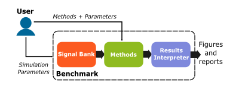
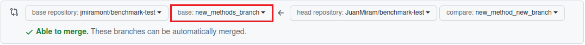
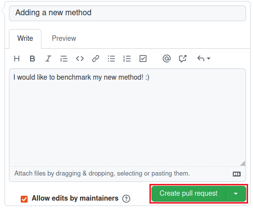

# A benchmark of signal denoising/ detection methods

## Documentation and Results

[](https://github.com/jmiramont/benchmark-test/actions/workflows/local_tests.yml)
[](results/results_denoising.md)
[](https://jmiramont.github.io/benchmark-test/)

## Related work

[](https://github.com/jmiramont/gretsi_2022_benchmark)

# What is this benchmark?

The goal of this benchmark is to keep an updated, public comparison between different methods for signal denoising / detecting. You can [upload your own method](#benchmarking-your-own-method-online) using a template file for the configuration of the benchmark and following the instructions below to make a pull request. After this, your method will be compared against others, for different signals, and noise conditions (you can also [check the current methods and results](results/results_denoising.md)). Do not hesitate to contact us should you find any trouble with the instructions :).

If you prefer, [you can download this repository as a toolbox, and run your own benchmarks](#benchmarking-your-method-in-your-computer) in your computer. This can be useful to make unbiased, researcher independent contrasts between your method and others. Additionally, you can explore different parameters of your method and use [more than 20 different signals](notebooks/demo_signal_bank.ipynb). As a result, you will obtain a series of ```.csv``` files with all the information you need to build figures for your articles and reports.

This benchmarks is an effort to provide the signal processing practitioners with a tool that makes research more efficient and transparent. We need your help to make it a valuable tool for the community, please do not hesitate to give us your feedback!

<!-- The methods to compare, the tests, and the performance evaluation functions were conceived as different modules, so that one can assess new methods without modifying the tests or the signals. On the one hand, the tests and the performance evaluation functions are encapsulated in the class `Benchmark`. On the other hand, the signals used in this benchmark are generated by the methods in the class `SignalBank`. The only restriction this poses is that the methods should receive a signal (and a perhaps a series of parameters) and output a denoised signal or a boolean variable indicating the presence (or not) of a signal. -->

The following block diagram depicts the relationship between the different block. The inward arrows represent the input of the user, who have to provide a number methods and (possibly) different parameters for them.



## Summary

- [How to use this benchmark?](#how-to-use-this-benchmark)
- [Benchmarking your own method online](#benchmarking-your-own-method-online)
- [Benchmarking your own method in your computer](#benchmarking-your-method-in-your-computer)
- [Matlab-implemented methods](#matlab-implemented-methods)

# How to use this benchmark?

You can use this benchmark to test a new method against others. There are at least two ways of doing this:

1. You can either **[make a new fork of this repository](#benchmarking-your-own-method-online)** and make a pull request with a new method to test. A workflow using GitHub actions will automatically detect your new method, run an online benchmark and update the results.
2. You can clone this repository and **[benchmark your own method locally](#benchmarking-your-method-in-your-computer)**, i.e. in your computer. This will allow you to run the benchmark with all the modifications you want (exploring different parameters for you method, type of signals, number of repetitions, etc.).

The [*notebooks*](./notebooks/) folder contains a number of minimal working examples to understand how this benchmark works and how you could use it for your project. In particular, [*demo_benchmark.ipynb*](./notebooks/demo_benchmark.ipynb) gives two minimal working examples to introduce the basic functionality of the `Benchmark` class, and the notebook [*demo_signal_bank.ipynb*](./notebooks/demo_signal_bank.ipynb) showcases the signals produced by the `SignalBank` class.

The instructions below will help you to add a new method and run the benchmark afterwards.


# Benchmarking your own method online

First you should have a local copy of this repository to add and modify files.
For this, [fork this repository](https://docs.github.com/en/get-started/quickstart/fork-a-repo), for example by using the "Fork" button above:


This will create a copy of the repository in your own GitHub account, the URL of which should look like

```bash
https://github.com/YOUR-USERNAME/benchmark-test
```

Now, let's create a local copy, i.e. in your computer, of the repository you have just forked. Open a terminal in a directory of your preference and use

```bash
git clone https://github.com/YOUR-USERNAME/benchmark-test.git
```

When a repository is forked, a copy of all the branches existing in the original one are also created. It would be better if you create a new branch to work in your own changes, mainly adding your new method to be tested. For this, create a new branch using:

```bash
git branch new_method
git checkout new_method
```

## Installation using ```poetry```

*Remark for conda users:*

*If you have [`Anaconda`](https://www.anaconda.com/) or [`Miniconda`](https://docs.conda.io/en/latest/miniconda.html) installed please disable the auto-activation of the base environment and your conda environment using:*

```bash
conda config --set auto_activate_base false
conda deactivate
```

Before starting to make changes in the repository, we need to install the basic dependencies of the benchmark. With that in mind, we use [```poetry```](https://python-poetry.org/docs/), a tool for dependency management and packaging in python. First install ```poetry``` following the steps described [here](https://python-poetry.org/docs/#installation). Once you're done with this, open a terminal in the directory where you clone the benchmark (or use the console in your preferred IDE). Then, make ```poetry``` create a virtual environment and install all the current dependencies of the benchmark using:

```bash
poetry install 
```

Your method might need particular modules as dependencies that are not currently listed in the dependencies of the default benchmark. You can add all your dependencies by modifying the ```.toml``` file in the folder, under the ```[tool.poetry.dependencies]``` section. For example:

```bash
[tool.poetry.dependencies]
python = ">=3.8,<3.11"
numpy = "^1.22.0"
matplotlib = "^3.5.1"
pandas = "^1.3.5"
```

A more convenient and interactive way to do this interactively is by using ```poetry```, for example:

```bash
poetry add numpy
```

and following the instructions prompted in the console.

Afer this, run

```bash
poetry update
```

to update the .lock file in the folder.

*Remark: Notice that the use of ```poetry``` for adding the dependencies of your packet is key for running the benchmark using [GitHub Actions](./.github/workflows), please consider this while adding your method.*

## Adding your own method

A new method can be tested against others by adding a file into the folder [src/methods](./src/methods) containing the definition of a class with some specific characteristics. We shall see how to do this in the following sections.

First, the function implementing your method must have the following signature:

```python
    def a_new_method(signal, params):
        ...
```

Methods should receive an ```(N,)``` numpy array representing a signal, where and `N` is the number of their time samples. Additionally, they should receive a second parameter `params` to allow testing different combinations of input parameters. The shape and type of the output depends on the task (*denoising* or *detection*):

- For Denoising: The output must be a numpy array and have the same shape as the input.
- For Detection: The output must be a boolean variable where ```False``` indicates no presence of a signal, and ```True``` that a signal has been detected.

In the following section, we will see how to create a class that compartmentalize your method and outline the instructions to run the benchmark.

### Using a template file for your method

Either your method is implemented in python or matlab, you must create a new ```.py``` file the name of which must start with *method_* and have certain content to be automatically discovered by the toolbox. The file should encapsulate your method in a new class. This is much easier than it sounds :). To make it simpler, [a file called *method_new_basic_template.py* is made available](./new_method_example/method_new_basic_template.py) which you can use as a template. You just have to fill in the parts that implement your method. Matlab users can also find a template [here](./new_method_example/method_new_basic_template_matlab.py).

Let's analyze the contents of the template file [*method_new_basic_template.py*](./new_method_example/method_new_basic_template.py), which is divided in three sections. In the first section, you can import a function with your method or implement everything in the same file:

```python
""" First section ----------------------------------------------------------------------
| Import here all the modules you need.
| Remark: Make sure that neither of those modules starts with "method_".
"""
from methods.benchmark_utils import MethodTemplate # Import the template!
```

Additionally, the [abstract class](https://docs.python.org/3/library/abc.html) `MethodTemplate` is imported here. Abstract classes are not implemented, but they serve the purpose of establishing a template for new classes, by forcing the implementation of certain *abstract* methods. We will see later that the class that encapsulates your method must inherit from this template.

The second section of the file should include all the functions your method needs to work. This functions could also be defined in a separate module imported in the previous section as well. Although it is not mandatory to add them here, but we recommend it so as to keep everything in a single file.

```python
""" Second section ---------------------------------------------------------------------
| Put here all the functions that your method uses.
| 
| def a_function_of_my_method(signal,params):
|   ...
"""
```

In the third and final section, your method is encapsulated in a new class called `NewMethod` (you can change this name if you prefer to, but it is not strictly necessary). As mentioned before, the only requisite for the class that represents your method is that it inherits from the [abstract class](https://docs.python.org/3/library/abc.html) `MethodTemplate`. This simply means that you will have to implement the class constructor and a class function called -unsurprisingly- `method()`:

```python
""" Third section ----------------------------------------------------------------------
| Create here a new class that will encapsulate your method.
| This class should inherit the abstract class MethodTemplate.
| You must then implement the class function: 

def method(self, signal, params)
    ...
| which should receive the signals and any parameters that you desire to pass to your
| method.
"""

class NewMethod(MethodTemplate):
    def __init__(self):
        self.id = 'a_new_method'
        self.task = 'denoising'  # Should be either 'denoising' or 'detection'

    def method(self, signals, params = None): # Implement this method.
        ...

    # def get_parameters(self):            # Use it to parametrize your method.
    #     return [None,]

```

The constructor function ```__init__(self)``` must initialize the attributes ```self.id``` and ```self.task```. The first is a string to identify your method in the benchmark. The second is the name of the task your method is devoted to. This can be either ```'denoising'``` or ```'detection'```. Notice that if you fail to use such names this will prevent you from benchmarking your method.

Lastly, as anticipated above, you have to implement the class function ```method(self, signals, params)```. This function may act as a wrapper of your method, i.e. you implement your method elsewhere and call it from this function, or you could implement it directly here. This is up to you :).

If you want to test your method using different sets of parameters, you can also implement the function `get_parameters()` to return a list with the desired input parameters (you can find an example of this [here](./new_method_example/method_new_with_parameters.py)).

*Remark: Do not modify the abstract class `MethodTemplate`*.

Finally, **you have to move the file** with all the modifications to the folder [/src/methods](./src/methods). Changing the name of the file is possible, but keep in mind that **the file's name must start with "*method_*" to be recognizable**.

### Checking everything is in order with ```pytest```

Once your dependencies are ready, you should check that everything is in order using the ```pytest``` testing suit. To do this, simply run the following in a console located in your local version of the repository:

```bash
poetry run pytest
```

This will check a series of important points for running the benchmark online, mainly:

1. Your method class inherits the ```MethodTemplate``` abstract class.
2. The inputs and outputs of your method follows the required format according to the designated task.

Once the tests are passed, you can now either create a pull request to run the benchmark remotely, or [run the benchmark locally](#running-this-benchmark-locally).

### Create a pull request

In order to run the benchmark remotely, you can request the addition of your method for benchmarking along with other existing ones. This can be done by creating a [Pull Request](https://docs.github.com/en/pull-requests/collaborating-with-pull-requests/proposing-changes-to-your-work-with-pull-requests/about-pull-requests). First, you need to update the remote version of your fork, now that you have added your new method and tested that it is working with ```pytest```. To do this, commit the changes and then push them to your remote repository:

```bash
git commit --all -m "Uploading a new method"
git push origin new_method
```

Now you can create a [new pull request](https://docs.github.com/en/pull-requests/collaborating-with-pull-requests/proposing-changes-to-your-work-with-pull-requests/creating-a-pull-request-from-a-fork) by using the "Contribute" button from the fork we have created before:


and then "Open a Pull Request". There you will need to select the branch where your changes are going to be made in the original repository of the benchmark. Please choose here "new_methods_branch":



Finally, send the pull request by clicking on "Create pull request":



You can also add an small comment in the "Write" field. A short explanation of the new method and related references (notes, articles, etc.) will be appreciated.

Once this is done, the benchmark is run remotely using [GitHub Actions](./.github/workflows) provided that the pull request is approved.

*Remark: Notice that ```pytest``` is also run again in this workflow. Therefore, keep in mind that if your method didn't pass the tests locally, it won't pass them at this stage either, and the pull request will not be approved*.

# Benchmarking your method in your computer

Running the benchmark in your own computer can be useful if you want to use a different set of parameters of the experiments. In order to do this, you should update the configuration files `config_denoising.yaml` and `config_detection.yaml` with parameters of your choice.

You should first either [download](https://github.com/jmiramont/benchmark-test/archive/refs/heads/main.zip) or clone this repository in your computer. Once you have done this, go to the folder where you cloned the repository and install the toolbox using ```poetry```:

```bash
poetry install
```

## Configuring the benchmark parameters

In the configuration files you can change:

1. The length of the simulation.
2. The signals you use.
3. The number of times each simulation is run.
4. The signal-to-noise ratios (SNRs, in dB) used in each simulation.
5. The parallelization parameters (if needed).

The following example shows how to select a length of simulation of 512 time samples, with SNRs of 0, 10, 20 and 30 dB, repeating each experiment 30 times and using a parallel pool of five workers. Notice that the signals to use during the experiments are selected by the `signal_id` given by the `SignalBank` class (in this case, a linear chirp and an exponential chirp).

```yaml
# ------------------------------------------------------------------
# Configuration file for benchmarking denoising methods:
# ------------------------------------------------------------------
N: 512
SNRin: [0, 10, 20, 30]
repetitions: 30
parallelize: 5
signal_names: ['LinearChirp', 'ExpChirp',] # Use signal_id of SignalBank class.     
```

Once the configuration is ready, you can use the following command to run the benchmark using `poetry` (assuming [all you dependencies have been added to the `.toml` file and installed](#installation-using-poetry)):

```bash
poetry run python run_this_benchmark.py
```

## Documenting your method

For documenting your code, please add docstrings following [PEP257](https://peps.python.org/pep-0257/#:~:text=The%20aim%20of%20this%20PEP,conventions%2C%20not%20laws%20or%20syntax.). A docstring must be added at the beginning of the definition of classes and functions. The minimum information required is:

- Summary of the class/function.
- Brief description of input/output parameters.
- Any possible exception raised from your method.

## Matlab-implemented methods

Benchmarking matlab-based methods is possible thanks to the incorporated matlab's python engine, that allows communication between python and a matlab's session.

Matlab python's engine is only compatible with certain python versions, depending on the local Matlab version you are running. If you are interested in using the benchmark locally, i.e. in your computer, [check that your version of matlab and python are compatible](https://www.mathworks.com/content/dam/mathworks/mathworks-dot-com/support/sysreq/files/python-compatibility.pdf).

Once you've checked your python and matlab versions are compatible, you can install the matlab engine in the [virtual environment created before](#installation-using-poetry) using poetry

```bash
poetry install -E matlab_tools
```

We now can see how to benchmark a method implemented in Matlab by slightly modifying the instructions given before to create the file that represents your method. A template file is given [here](./new_method_example/method_new_basic_template_matlab.py) for interested users. Let us highlight the main differences in this template.

First, in the first section of the file, you must import the class ```MatlabInterface```, which will simply act as an interface between python and a Matlab session where your method will be run:

```python

from methods.benchmark_utils import MethodTemplate, MatlabInterface
# You must import the MethodTemplate abstract class and the MatlabInterface class.

```

Then, you must  **move the ```.m``` with your method to the folder ```src\methods```**. After this you can now create a ```MatlabInterface``` instance that represents your method, by passing a string to the ```MatlabInterface``` creator. For example:

```python
# After moving a file called 'my_matlab_method.m' to src\methods, create an interface with the matlab engine by passing the name of the function file (without the .m extension). Then get the matlab function as:
mlint = MatlabInterface('my_matlab_method') 
matlab_function = mlint.matlab_function # A python function handler to the method.
```

Now you are ready to complete the third section of the file. You can use this exactly as it is in the template file, provided you have done all the precedent steps.

```python
class NewMethod(MethodTemplate):

    def __init__(self):
        self.id = 'a_matlab_method'
        self.task = 'denoising'
        

    def method(self, signal, *params):
        """ A class method encapsulating a matlab function.

        Args:
            signals (numpy array): A signal.
            params: Any number of positional parameters.
        """
        signal_output = matlab_function(signal, *params) # Only positional args.

        return signal_output

```

*Remark: The ```MatlabInterface``` class will cast the input parameters in the appropriate Matlab types.*

*Remark 2: A Matlab method must comply with the [output parameters shapes expected by the toolbox](#benchmarking-your-own-method). Matlab vectors of double type numbers will be casted into numpy arrays of floats, and Matlab's boolean types will be casted into python booleans. If your method returns more than one parameter, only the first one returned is taken*.
