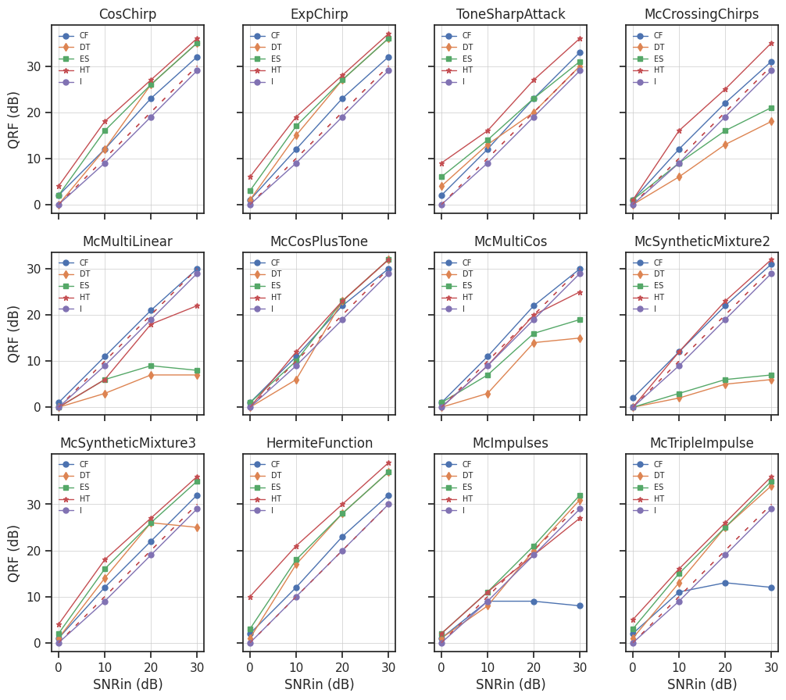

# Benchmark Report 

## Configuration 

Length of signals: 512

Repetitions: 30

SNRin values: 
0, 
10, 
20, 
30, 

### Methods  

* contour_filtering 

* delaunay_triangulation 

* empty_space 

* hard_thresholding 

### Signals  

* CosChirp 

* ExpChirp 

* ToneSharpAttack 

* McMultiLinear 

* McCosPlusTone 

* McMultiCos 

* McSyntheticMixture2 

* McSyntheticMixture3 

* HermiteFunction 

* McImpulses 

* McTripleImpulse 

## Figures:
  

## Mean results tables: 
### Signal: CosChirp
|    | Method + Param         |   SNRin: 0dB |   SNRin: 10dB |   SNRin: 20dB |   SNRin: 30dB |
|---:|:-----------------------|-------------:|--------------:|--------------:|--------------:|
|  0 | contour_filtering      |      2.05412 |       12.0973 |       23.016  |       32.4538 |
|  1 | delaunay_triangulation |      0.97065 |       12.4395 |       26.3115 |       35.8374 |
|  2 | empty_space            |      2.26223 |       16.3672 |       26.39   |       35.8414 |
|  3 | hard_thresholding      |      4.82755 |       18.2149 |       27.7513 |       36.9504 |
### Signal: ExpChirp
|    | Method + Param         |   SNRin: 0dB |   SNRin: 10dB |   SNRin: 20dB |   SNRin: 30dB |
|---:|:-----------------------|-------------:|--------------:|--------------:|--------------:|
|  0 | contour_filtering      |      1.99719 |       12.0324 |       23.1567 |       32.5158 |
|  1 | delaunay_triangulation |      1.56534 |       15.5307 |       27.2599 |       36.619  |
|  2 | empty_space            |      3.1355  |       17.1141 |       27.1871 |       36.5277 |
|  3 | hard_thresholding      |      6.4353  |       19.3687 |       28.7225 |       37.7722 |
### Signal: ToneSharpAttack
|    | Method + Param         |   SNRin: 0dB |   SNRin: 10dB |   SNRin: 20dB |   SNRin: 30dB |
|---:|:-----------------------|-------------:|--------------:|--------------:|--------------:|
|  0 | contour_filtering      |      2.00809 |       12.0441 |       23.1358 |       33.1751 |
|  1 | delaunay_triangulation |      4.21406 |       13.6331 |       20.6572 |       30.3836 |
|  2 | empty_space            |      6.45899 |       14.9482 |       23.2178 |       31.2125 |
|  3 | hard_thresholding      |      9.79415 |       16.9689 |       27.1718 |       36.9764 |
### Signal: McMultiLinear
|    | Method + Param         |   SNRin: 0dB |   SNRin: 10dB |   SNRin: 20dB |   SNRin: 30dB |
|---:|:-----------------------|-------------:|--------------:|--------------:|--------------:|
|  0 | contour_filtering      |    1.75101   |      11.4496  |      21.8031  |      29.9647  |
|  1 | delaunay_triangulation |    0.254653  |       3.21651 |       7.82963 |       7.72069 |
|  2 | empty_space            |    0.784962  |       6.11267 |       9.20022 |       8.78515 |
|  3 | hard_thresholding      |    0.0810032 |       6.49078 |      18.6563  |      22.597   |
### Signal: McCosPlusTone
|    | Method + Param         |   SNRin: 0dB |   SNRin: 10dB |   SNRin: 20dB |   SNRin: 30dB |
|---:|:-----------------------|-------------:|--------------:|--------------:|--------------:|
|  0 | contour_filtering      |     1.9468   |      11.8178  |       22.1095 |       30.4876 |
|  1 | delaunay_triangulation |     0.376783 |       6.45897 |       23.5644 |       32.8347 |
|  2 | empty_space            |     1.16523  |      10.8574  |       23.8025 |       32.83   |
|  3 | hard_thresholding      |     0.248789 |      11.9088  |       23.4074 |       32.7268 |
### Signal: McMultiCos
|    | Method + Param         |   SNRin: 0dB |   SNRin: 10dB |   SNRin: 20dB |   SNRin: 30dB |
|---:|:-----------------------|-------------:|--------------:|--------------:|--------------:|
|  0 | contour_filtering      |     1.93618  |      11.9102  |       22.0095 |       30.5662 |
|  1 | delaunay_triangulation |     0.318162 |       3.99928 |       14.3566 |       15.0112 |
|  2 | empty_space            |     0.953374 |       7.91884 |       17.106  |       19.6513 |
|  3 | hard_thresholding      |     0.146604 |       9.39388 |       20.2296 |       25.6702 |
### Signal: McSyntheticMixture2
|    | Method + Param         |   SNRin: 0dB |   SNRin: 10dB |   SNRin: 20dB |   SNRin: 30dB |
|---:|:-----------------------|-------------:|--------------:|--------------:|--------------:|
|  0 | contour_filtering      |     2.03096  |      12.2876  |      22.8756  |      31.6208  |
|  1 | delaunay_triangulation |     0.105827 |       1.88203 |       5.16742 |       6.26283 |
|  2 | empty_space            |     0.522443 |       3.85706 |       6.52043 |       7.19364 |
|  3 | hard_thresholding      |     0.398852 |      12.9633  |      23.7243  |      32.8869  |
### Signal: McSyntheticMixture3
|    | Method + Param         |   SNRin: 0dB |   SNRin: 10dB |   SNRin: 20dB |   SNRin: 30dB |
|---:|:-----------------------|-------------:|--------------:|--------------:|--------------:|
|  0 | contour_filtering      |      1.98092 |       12.0045 |       22.9306 |       32.0972 |
|  1 | delaunay_triangulation |      1.24141 |       14.1668 |       26.2819 |       26.395  |
|  2 | empty_space            |      2.58774 |       16.7602 |       26.2248 |       35.6359 |
|  3 | hard_thresholding      |      4.57427 |       18.3439 |       27.5923 |       36.5546 |
### Signal: HermiteFunction
|    | Method + Param         |   SNRin: 0dB |   SNRin: 10dB |   SNRin: 20dB |   SNRin: 30dB |
|---:|:-----------------------|-------------:|--------------:|--------------:|--------------:|
|  0 | contour_filtering      |      2.10949 |       12.1331 |       23.1269 |       32.4209 |
|  1 | delaunay_triangulation |      1.84155 |       17.7617 |       28.4264 |       37.9085 |
|  2 | empty_space            |      3.82278 |       18.3558 |       27.9769 |       37.4865 |
|  3 | hard_thresholding      |      9.84083 |       20.8269 |       29.9312 |       39.221  |
### Signal: McImpulses
|    | Method + Param         |   SNRin: 0dB |   SNRin: 10dB |   SNRin: 20dB |   SNRin: 30dB |
|---:|:-----------------------|-------------:|--------------:|--------------:|--------------:|
|  0 | contour_filtering      |      1.89487 |       8.95431 |       9.39811 |       8.22878 |
|  1 | delaunay_triangulation |      1.04483 |       8.13347 |      19.9893  |      31.0524  |
|  2 | empty_space            |      2.37912 |      11.2342  |      21.942   |      32.4646  |
|  3 | hard_thresholding      |      2.90489 |      10.9519  |      19.5573  |      27.5127  |
### Signal: McTripleImpulse
|    | Method + Param         |   SNRin: 0dB |   SNRin: 10dB |   SNRin: 20dB |   SNRin: 30dB |
|---:|:-----------------------|-------------:|--------------:|--------------:|--------------:|
|  0 | contour_filtering      |      2.32118 |       11.1883 |       13.0497 |       12.0926 |
|  1 | delaunay_triangulation |      1.67669 |       13.0938 |       25.3201 |       34.107  |
|  2 | empty_space            |      3.49818 |       15.3156 |       25.8764 |       35.0839 |
|  3 | hard_thresholding      |      5.83074 |       16.8183 |       26.7812 |       36.179  |
