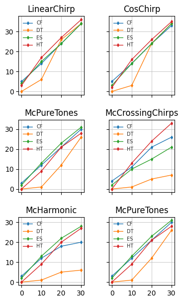

# Benchmark Report 

## Configuration 

Length of signals: 256

Repetitions: 30

SNRin values: 
0, 
10, 
20, 
30, 

### Methods  

* contour_filtering 

* delaunay_triangulation 

* empty_space 

* hard_thresholding 

### Signals  

* LinearChirp 

* CosChirp 

* ExpChirp 

* McCrossingChirps 

* McHarmonic 

* McPureTones 

## Figures:
  

## Mean results tables: 
### Signal: LinearChirp
|    | Method + Param         |   SNRin: 0dB |   SNRin: 10dB |   SNRin: 20dB |   SNRin: 30dB |
|---:|:-----------------------|-------------:|--------------:|--------------:|--------------:|
|  0 | contour_filtering      |     5.37704  |      14.8311  |       24.589  |       34.0679 |
|  1 | delaunay_triangulation |     0.212631 |       6.82761 |       26.6031 |       32.9449 |
|  2 | empty_space            |     4.58463  |      15.2684  |       25.0615 |       34.5046 |
|  3 | hard_thresholding      |     3.43259  |      17.9972  |       27.6087 |       36.5416 |
### Signal: CosChirp
|    | Method + Param         |   SNRin: 0dB |   SNRin: 10dB |   SNRin: 20dB |   SNRin: 30dB |
|---:|:-----------------------|-------------:|--------------:|--------------:|--------------:|
|  0 | contour_filtering      |     5.38481  |      14.6874  |       23.9881 |       33.2639 |
|  1 | delaunay_triangulation |     0.116739 |       3.54162 |       24.5353 |       34.3173 |
|  2 | empty_space            |     3.92005  |      15.0158  |       24.6107 |       34.0713 |
|  3 | hard_thresholding      |     2.03568  |      16.6472  |       26.3267 |       35.2297 |
### Signal: ExpChirp
|    | Method + Param         |   SNRin: 0dB |   SNRin: 10dB |   SNRin: 20dB |   SNRin: 30dB |
|---:|:-----------------------|-------------:|--------------:|--------------:|--------------:|
|  0 | contour_filtering      |     5.21896  |      13.9292  |       21.4989 |       24.2605 |
|  1 | delaunay_triangulation |     0.116532 |       4.35687 |       16.4281 |       11.2668 |
|  2 | empty_space            |     4.03492  |      14.3823  |       22.7572 |       27.7974 |
|  3 | hard_thresholding      |     2.4301   |      15.8889  |       23.4429 |       32.84   |
### Signal: McCrossingChirps
|    | Method + Param         |   SNRin: 0dB |   SNRin: 10dB |   SNRin: 20dB |   SNRin: 30dB |
|---:|:-----------------------|-------------:|--------------:|--------------:|--------------:|
|  0 | contour_filtering      |    4.53916   |      11.827   |      21.0698  |      26.6523  |
|  1 | delaunay_triangulation |   -0.0498124 |       1.49014 |       5.56573 |       7.47399 |
|  2 | empty_space            |    2.83473   |      11.2604  |      16.2598  |      21.0335  |
|  3 | hard_thresholding      |    0.511069  |      13.0222  |      24.4241  |      33.9696  |
### Signal: McHarmonic
|    | Method + Param         |   SNRin: 0dB |   SNRin: 10dB |   SNRin: 20dB |   SNRin: 30dB |
|---:|:-----------------------|-------------:|--------------:|--------------:|--------------:|
|  0 | contour_filtering      |    4.04647   |      12.7377  |      18.7696  |      21.1605  |
|  1 | delaunay_triangulation |    0.0304333 |       1.14294 |       5.49035 |       7.02051 |
|  2 | empty_space            |    2.70696   |      13.4394  |      22.6881  |      28.5135  |
|  3 | hard_thresholding      |    0.152945  |       9.66327 |      20.3192  |      27.5464  |
### Signal: McPureTones
|    | Method + Param         |   SNRin: 0dB |   SNRin: 10dB |   SNRin: 20dB |   SNRin: 30dB |
|---:|:-----------------------|-------------:|--------------:|--------------:|--------------:|
|  0 | contour_filtering      |    3.56828   |      12.88    |       21.9999 |       30.1941 |
|  1 | delaunay_triangulation |    0.0122155 |       1.32144 |       11.5173 |       25.5166 |
|  2 | empty_space            |    2.58947   |      13.5192  |       23.1161 |       31.4813 |
|  3 | hard_thresholding      |    0.0651525 |       9.45077 |       21.7012 |       28.5105 |
